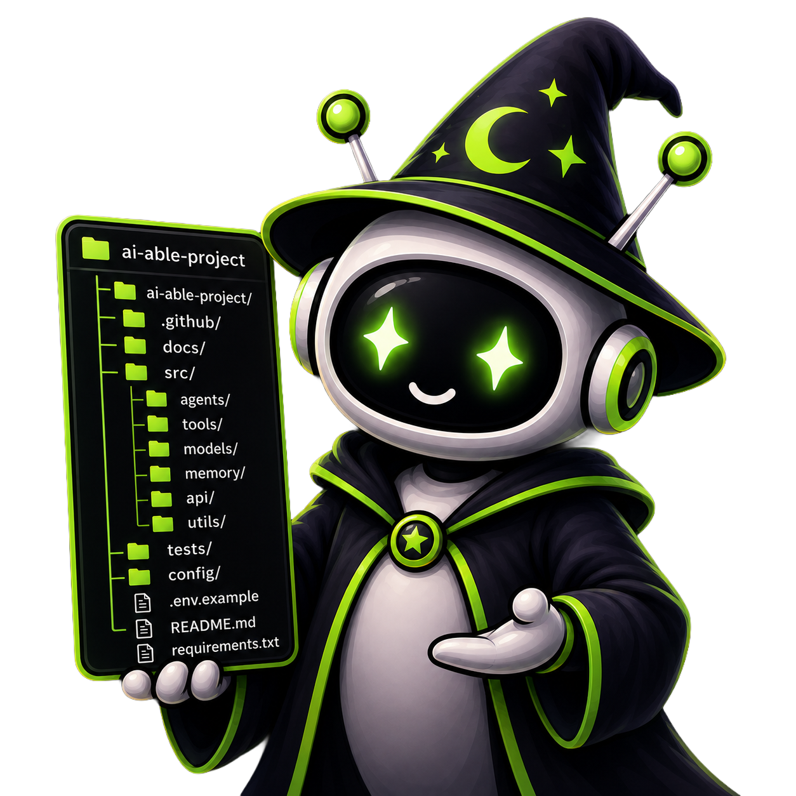

# AI Zoll

<p align="center">
  
</p>

**AI Zoll is a CLI that prepares, structures, and maintains the context AI coding
agents need to work effectively.** It does not write your application code — Claude
Code, Cursor, Codex, and Copilot remain the builders. Zoll prepares the environment in
which they build, and keeps it in sync as your project or your chosen agent changes.

Fully local, fully self-contained: no dashboard, no server, no account, no database.
AI is never required — every command works entirely offline by default; the real,
LLM-backed provider is a strict, explicit opt-in (`--ai`), never turned on just because
a credential happens to be present in your shell.

## Commands

```bash
npx ai-zoll init [--ai]      # New project: interactive wizard -> validated Blueprint
                              # -> generated AI-context workspace (PROJECT.md,
                              # ARCHITECTURE.md, AGENTS.md, docs/, skills/,
                              # workflows/, agent-specific files)

npx ai-zoll analyze [--ai]   # Existing project: deterministically analyzes the repo
                              # (framework, database, testing, auth, directory
                              # conventions — monorepo-aware) and generates the
                              # missing AI-context layer around it, without touching
                              # your existing source or any pre-existing docs

npx ai-zoll sync [agent]     # Re-sync an already-initialized project, or switch to a
                              # different agent — regenerates the managed content,
                              # preserving anything you've hand-written below each
                              # file's managed-region marker
```

Both `init` and `analyze` are non-destructive: a file that already exists and wasn't
generated by ai-zoll (no managed-region markers) is left completely untouched and
reported back, never silently overwritten.

## Repository layout

```
apps/
  cli/          The CLI (npx ai-zoll ...) — the only app in this repo
packages/
  blueprint/    Canonical Project Blueprint: schema, types, validation (Zod)
  generators/   Deterministic template engine (blueprint -> workspace)
  agents/       AgentAdapter implementations (claude, cursor, codex, copilot)
  templates/    Raw templates used by generators (currently unused, see its README)
  analyzer/     Deterministic, monorepo-aware repository analyzers
  ai/           AIProvider abstraction (MockAIProvider default, ClaudeAIProvider --ai opt-in)
  shared/       Cross-cutting types/utilities
docs/            Product spec, plan docs, ADRs, glossary
.claude/skills/  Process skills for building Zoll itself
```

## Getting started (developing ai-zoll itself)

```bash
pnpm install
pnpm run build
pnpm run test
```

Then try the CLI locally:

```bash
cd apps/cli && pnpm build
node dist/index.js init         # try it on a new project
node dist/index.js analyze      # try it on an existing project (run from that project's dir)
```

## Documentation map

- [`docs/PRODUCT_SPEC.md`](docs/PRODUCT_SPEC.md) — original product spec (written for a
  broader dashboard+API vision; where it describes those, treat it as historical — see
  `CLAUDE.md` for the current CLI-only direction)
- [`docs/plan/03-roadmap.md`](docs/plan/03-roadmap.md) — phase-by-phase status, the most
  up-to-date single source of truth for what's built vs. pending
- [`docs/decisions/`](docs/decisions/) — Architecture Decision Records
- [`docs/glossary.md`](docs/glossary.md) — product terminology
- [`CLAUDE.md`](CLAUDE.md) — instructions for AI coding agents working in this repo
- [`CONTRIBUTING.md`](CONTRIBUTING.md) — human contributor workflow

## License

MIT — see [`LICENSE`](LICENSE).
